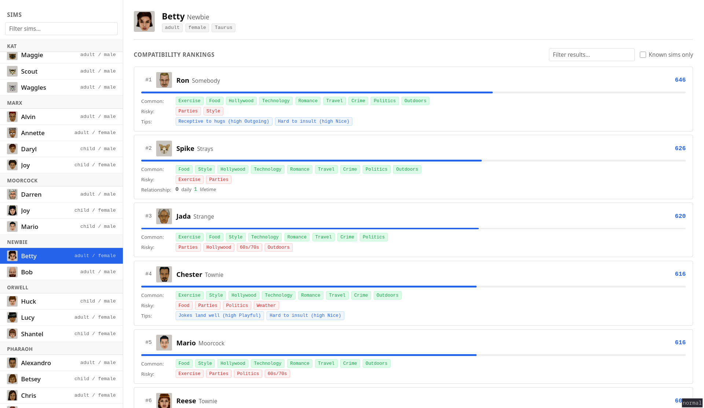

# Sims 1 Compatibility Checker



Figure out which sims should talk to whom, based on shared interests.

Drop your `UserData/` folder from The Sims 1 (Complete Collection / Legacy) into the project root and start the servers.

## Setup

```bash
# Backend
uv run fastapi dev api/main.py

# Frontend (separate terminal)
cd frontend && npm install && npm run dev
```

Open http://localhost:5173

## How it works

The backend parses `UserData/Neighborhood.iff` to extract sim data: names, portraits, personality traits, interests, zodiac signs, and existing relationships. It then scores compatibility between any two sims based on their 15 interest topics (8 base game + 7 Hot Date).

The scoring is **100% interest-based**, matching actual game mechanics decoded from BHAV behavior scripts in the game's IFF files. In The Sims 1:

- **Interests** drive conversation outcomes. The game threshold is 400 (on 0-1000 scale): above means positive, below means negative. Two sims who both like a topic get a bonus; disagreement on a topic is penalized.
- **Personality** only gates which interactions are available (e.g., mean sims can insult, playful sims can tickle). It does not affect relationship score changes.
- **Zodiac signs** are purely cosmetic — displayed in Create-A-Sim but never read by any game script. The zodiac compatibility tables found online are from The Sims 2, not The Sims 1.
